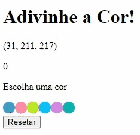

# Boas vindas ao repositório do projeto de adivinhação de Cor!

# Habilidades

- Manipular o DOM.

- Manipular o Javascript.

- Manipular o CSS.

---

## O que foi desenvolvido

- Uma aplicação utilizando JavaScript, HTML5 e CSS3.

- Nesta aplicação é possível jogar um jogo de adivinhação de cores e sua pontuação atualiza de acordo com os acertos.

## Captura de tela

